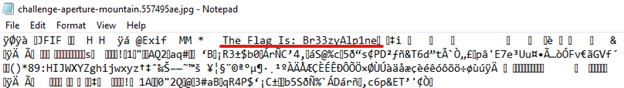

### Briefing: 
Our team have been monitoring The Choppers' web traffic and it seems they've been spending a lot of time on a photo-sharing site, especially one particular page. Did you know you can hide a message inside a file? Maybe this image contains a hidden message. Why don't you take a look and see if you can find out? 

**Tip:** The flag is in the image. 

### Hint:
Perhaps try opening the image in a text editor or using your local terminal to look for strings in the file. If there's a secret message in there, those will be great ways to find it.

### How to Solve: 
1. Download the image file and open it with a word processor like Notepad. 
    2. The first line will have "The Flag Is: Br33zyAlp1ne"

### Answer:
- Br33zyAlp1ne

### Assets:
