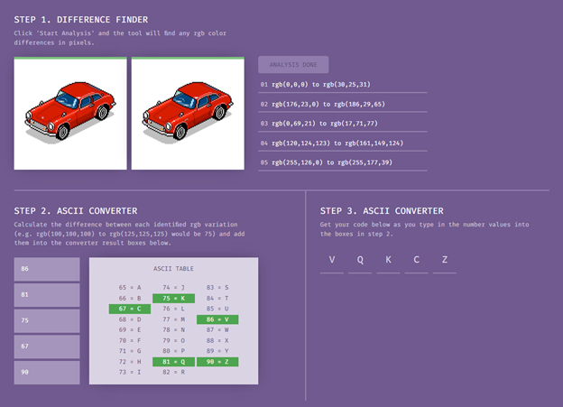

### Briefing: 
The Yakoottees love their cars. And so you'd expect that they might send each other car photos, images and even art. But recently we intercepted something strange: a pixel drawing of a car. What's strange about it? One of the gang, Kanako, sent two copies of it to another gang member. After some initial analysis we noticed some slight variations in colour in a selection of pixels.

One of the team has already built a comparison tool but he's just been reassigned to another urgent project. Perhaps you could take a look at what he's built and finish the analysis.

**Tip:** Calculate the differences, convert it with the ASCII table, and that's your flag.

### Hint:
It looks like they're using the change in rgb values between the pixels to generate a set of numbers, which they're then converting to text with the help of an ASCII table. Work out the differences, do the conversion and there's your flag.

### How to Solve: 
1. Click the "START ANALYSIS" button to get the RGB's to enter into Step 2.
2. Calculate the differences between each RGB:
    1. 01 – (30+25+31) - (0+0+0) = 86
    2. 02 – (186+29+65) - (176+23+0) = 81
    3. 03 – (17+71+77) - (0+69+21) = 75
    4. 04 – (161+149+124) - (128+124+123) = 67
    5. 05 – (255+177+39) - (255+126+0) = 98

### Answer:
- VQKCZ

### Assets:
