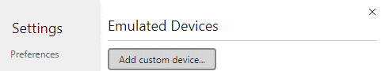
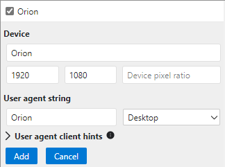

### Briefing: 
Whilst monitoring the gang's web traffic, we noticed they've been visiting one particular page quite a lot. When we try we get rejected immediately without it even asking for a username or password.

Our field agent, who is working for the Yakoottees undercover, thinks it might be something to do with a particular browser that the gang built themselves called "Orion". Time for you to investigate. Try looking for a developer tool in the browser to help you out.

**Tip:** To get the flag, get access to the page!

### Hint:
Do you know much about browser agents? Each browser sends a user agent to each web page it visits. This user agent tells the website which browser you are using. If you can figure out how to change it, you might be able to make the page think you're using the browser that the Yakoottees use.

### How to Solve: 
1. Depending on the browser you're using..
    1. Open the developer tools.
    2. Click the Emulation button:
    
    3. Click the dimensions dropdown:
    
    4. In the edit menu, click the button to add a custom device:
    
    5. Add these settings:
    
    6. Reload the page and the flag should appear at the top.