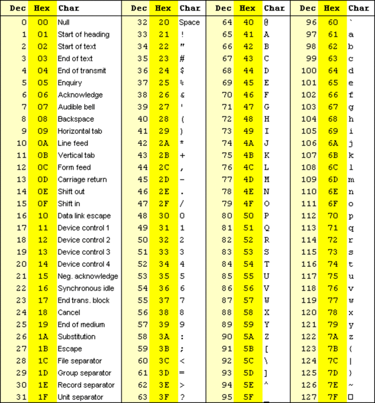

### Briefing: 
Agents believe they have found a server belonging to a gang called the Yakoottees. If we can get access to it who knows what information we can gather on them! So far the Yakoottees have been very successful hiding their activities by **encoding** everything they do. We've found their server but **don't have the password** and so can't login. Can you help, intern? 

**Tip:** Login to the server to get the flag. 

### Hint: 
Above the password prompt it looks like something has been encoded, maybe it's a message that will help point us in the right direction? See if you can figure out what encoding is being used and decode it.

### How to Solve: 
1. Copy the entire code from `\x57` to `\x21` and paste elsewhere for better readability.
2. Convert the HEX to ASCII.
```
\x57\x65\x6c\x63\x6f\x6d\x65\x20\x74\x6f\x20\x74\x68\x65\x20\x36\x31\x30\x65\x6e\x43\x30\x64\x65\x20\x73\x65\x72\x76\x65\x72\x2e\x20\x54\x68\x65\x20\x73\x65\x72\x76\x65\x72\x20\x70\x61\x73\x73\x77\x6f\x72\x64\x20\x69\x73\x20\x34\x66\x31\x62\x32\x35\x32\x30\x35\x35\x20\x2d\x20\x67\x72\x65\x61\x74\x20\x64\x65\x63\x6f\x64\x69\x6e\x67\x20\x42\x54\x57\x2c\x20\x6c\x61\x74\x65\x72\x7a\x2
```
**Translated:** Welcome to the 610enC0de server. The server password is 4f1b252055 - great decoding BTW, laterz!
3. Enter the password `4f1b252055` to get the flag.

### Assets:
