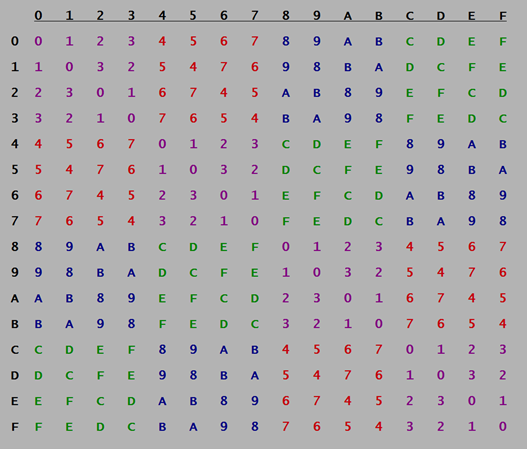

### Briefing: 
Intern, the agency have been in contact with a rival hacker who goes by the name "**ROXy**". She keeps telling us she runs a **logical operation**, particularly when analysing differences in values, but we're not sure what she means.

ROXy is willing to work with us... if we can prove we're as smart as she is. Before handing over any information, she's given us a code to break first.

If you can help us unravel this code, we'll gain an important new informant.

**Tip:** The flag is the secret code.

### Hint: 
Agent Q just noticed the informant's name, "ROXy", has XOR in it backwards... it may be just a coincidence, but we don't think so.

It also looks like the values are all in the 0-9 and A-F range, we think there's an encoding scheme like that?

### How to Solve: 
1. Calculate the XOR of both HEXs:
  `0xB105F00D`
  `0xAAA8400A` 
= `0x1BADB007`

### Answer:
- 0x1BADB007

### Assets:
